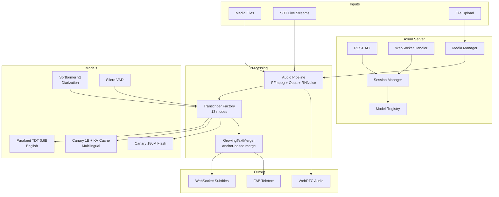

# parakeet-rs

[](https://github.com/altunenes/parakeet-rs/actions/workflows/rust.yml)
[](https://crates.io/crates/parakeet-rs)
[](LICENSE)

Real-time speech recognition server and Rust library built on NVIDIA's Parakeet ASR models via ONNX Runtime. Provides a multi-session WebRTC transcription server with live subtitles, speaker diarization, FAB teletext forwarding, and 13 transcription modes optimized for different latency/accuracy trade-offs.

## Features

| Category | Features |
|----------|----------|
| **ASR Models** | Parakeet TDT 0.6B (English), Canary 1B with KV cache (multilingual: en/de/fr/es), Canary 180M Flash |
| **Streaming** | 13 transcription modes from extreme-low-latency (~1.3s) to batch VoD processing |
| **Diarization** | Sortformer v2 streaming speaker diarization (up to 4 speakers) |
| **Server** | Axum HTTP/WS server, multi-session, REST API, WebSocket subtitles |
| **Audio Input** | Media file playback, SRT live streams (14 channels), file upload (up to 2GB) |
| **WebRTC** | Browser audio playback via WebRTC with TURN/STUN NAT traversal |
| **FAB Teletext** | Live transcription forwarding to FAB endpoints with teletext line splitting (42x2 chars) |
| **Text Processing** | GrowingTextMerger (anchor-based tail-overwrite), sentence boundary detection, deduplication |
| **Noise Cancellation** | RNNoise real-time noise suppression |
| **Frontend** | Web UI with session management, live subtitles, WebRTC audio, transcript export |
| **Testing** | 199 Rust tests + 34 Playwright E2E tests |

## Tech Stack

| Layer | Technology |
|-------|------------|
| **Runtime** | Rust, Tokio async runtime |
| **Backend** | Axum (HTTP/WS), WebRTC (webrtc-rs), SRT (FFmpeg) |
| **Inference** | ONNX Runtime (CPU/CUDA/TensorRT), ndarray |
| **Models** | Parakeet TDT 0.6B, Canary 1B, Canary 180M Flash, Sortformer v2, Silero VAD |
| **Audio** | FFmpeg (decode), Opus (encode), RNNoise (denoise), rubato (resample) |
| **Frontend** | Vanilla JS, WebRTC API, WebSocket API |
| **Testing** | Rust test framework, Playwright (Bun), German TTS fixtures |

## Architecture



## Quick Start

### Library Usage

```rust
use parakeet_rs::ParakeetTDT;

let mut parakeet = ParakeetTDT::from_pretrained("./tdt", None)?;
let result = parakeet.transcribe_file("audio.wav")?;
println!("{}", result.text);
```

### Server Usage

```bash
# Build
ORT_DYLIB_PATH=/usr/local/lib/libonnxruntime.so \
  cargo build --release --features "server,sortformer"

# Configure
cp .env.example .env  # Edit model paths, port, FAB settings

# Run
./start-server.sh
# Server starts on http://localhost:80
```

See [docs/deployment.md](docs/deployment.md) for full configuration reference.

## Transcription Models

| Model | Type | Languages | Parameters | Use Case |
|-------|------|-----------|------------|----------|
| **Parakeet TDT 0.6B** | FastConformer-TDT | English | 600M | Fast, accurate English ASR with token timestamps |
| **Canary 1B** | Encoder-Decoder + KV Cache | en, de, fr, es | 1B | Multilingual ASR with O(n) cached decoding |
| **Canary 180M Flash** | Encoder-Decoder | en, de, fr, es | 180M | Faster multilingual variant, lower accuracy |
| **Sortformer v2** | Streaming Diarization | Language-agnostic | - | Up to 4-speaker identification |
| **Silero VAD** | Voice Activity Detection | Language-agnostic | - | Speech/silence boundary detection |

## Transcription Modes

| Mode | Latency | Description |
|------|---------|-------------|
| `speedy` | ~0.3-1.5s | Best balance of latency and quality with pause detection |
| `pause_based` | ~0.5-2.0s | Better accuracy with pause detection |
| `low_latency` | ~3.5s | Fixed latency without pause detection |
| `ultra_low_latency` | ~2.5s | Faster response for interactive use |
| `extreme_low_latency` | ~1.3s | Fastest possible, may sacrifice accuracy |
| `lookahead` | ~1.0-3.0s | Best quality with future context |
| `vad_speedy` | ~0.3s pause | VAD-triggered, transcribes complete utterances |
| `vad_pause_based` | ~0.7s pause | VAD-triggered with longer pause detection |
| `vad_sliding_window` | 5 seg / 10s | Sliding window VAD with context overlap |
| `asr` | continuous | Pure streaming without VAD |
| `parallel` | sliding window | Multi-threaded parallel inference (4-8 threads) |
| `pause_parallel` | pause-triggered | Pause-triggered parallel inference with ordered output |
| `vod` | batch | Batch processing in 10-min chunks with deduplication |

See [docs/transcription-modes.md](docs/transcription-modes.md) for detailed configuration.

## Documentation

| Document | Description |
|----------|-------------|
| [Architecture](docs/architecture.md) | System design, audio pipeline, session lifecycle, module structure |
| [API Reference](docs/api.md) | REST endpoints, WebSocket protocol, response format |
| [Transcription Modes](docs/transcription-modes.md) | All 13 modes with configuration parameters and selection guide |
| [Frontend](docs/frontend.md) | Web UI, JavaScript modules, subtitle processing pipeline |
| [FAB Teletext](docs/fab-teletext.md) | FAB forwarding system, teletext splitting, deduplication |
| [Testing](docs/testing.md) | 199 Rust tests + 34 E2E tests, fixtures, running tests |
| [Deployment](docs/deployment.md) | Environment variables, CLI arguments, model setup, SRT channels |

## License

Code: MIT OR Apache-2.0

The Parakeet ONNX models (downloaded separately from HuggingFace) are licensed under **CC-BY-4.0** by NVIDIA. This library does not distribute the models.
