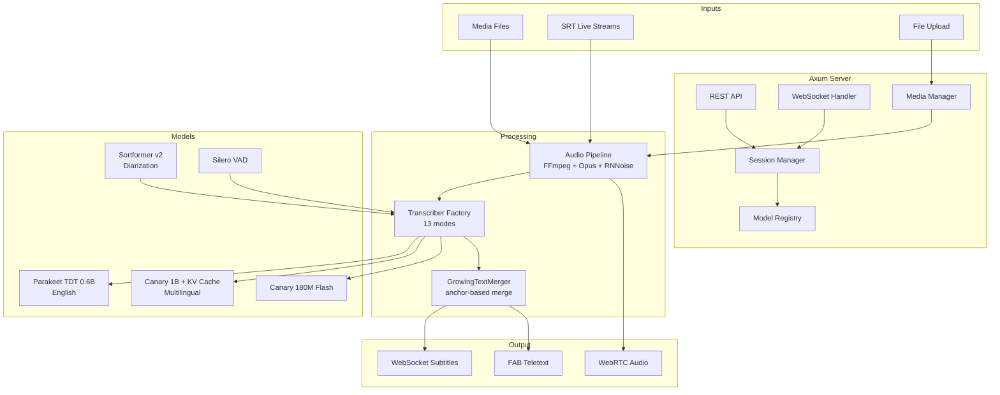

# parakeet-rs

[](https://github.com/altunenes/parakeet-rs/actions/workflows/rust.yml)
[](https://crates.io/crates/parakeet-rs)
[](LICENSE)

Real-time speech recognition with two server backends sharing one frontend. The Rust server handles ONNX/whisper.cpp models (CPU/GPU), while a standalone Python server serves Voxtral-Mini-4B via vLLM (GPU). Both provide multi-session WebRTC transcription with live subtitles and speaker diarization.

## Features

| Category | Features |
|----------|----------|
| **ASR Models** | Parakeet TDT 0.6B (English), Canary 1B (en/de/fr/es), Whisper (99+ langs), Voxtral Mini 4B (13 langs, GPU) |
| **Streaming** | 3 transcription modes: speedy, growing_segments, pause_segmented |
| **Diarization** | Sortformer v2 streaming speaker diarization (up to 4 speakers) |
| **Server** | Axum HTTP/WS server, multi-session, REST API, WebSocket subtitles |
| **Audio Input** | Media file playback, SRT live streams (14 channels), file upload (up to 2GB) |
| **WebRTC** | Browser audio playback via WebRTC with TURN/STUN NAT traversal |
| **FAB Teletext** | Live transcription forwarding to FAB endpoints with teletext line splitting (42x2 chars) |
| **Text Processing** | GrowingTextMerger (anchor-based tail-overwrite), sentence boundary detection, deduplication, German text normalization (WER evaluation) |
| **Noise Cancellation** | RNNoise real-time noise suppression |
| **Frontend** | Web UI with session management, live subtitles, WebRTC audio, transcript export |
| **Testing** | 173 Rust tests, Voxtral benchmark (3.3% WER on German broadcast) |

## Tech Stack

| Layer | Technology |
|-------|------------|
| **Runtime** | Rust, Tokio async runtime |
| **Backend** | Axum (HTTP/WS), WebRTC (webrtc-rs), SRT (FFmpeg) |
| **Inference** | ONNX Runtime (CPU/CUDA), whisper.cpp (GGML), vLLM (Voxtral GPU) |
| **Models** | Parakeet TDT 0.6B, Canary 1B, Whisper (GGML), Voxtral Mini 4B, Sortformer v2, Silero VAD |
| **Audio** | FFmpeg (decode), Opus (encode), RNNoise (denoise), rubato (resample) |
| **Frontend** | Vanilla JS, WebRTC API, WebSocket API |
| **Testing** | Rust test framework, Playwright (Bun), German TTS fixtures |

## Architecture


```mermaid
graph TD
    subgraph Inputs
        MF[Media Files]
        SRT[SRT Live Streams]
        UL[File Upload]
    end

    subgraph Server["Axum Server"]
        API[REST API]
        WS[WebSocket Handler]
        SM[Session Manager]
        MR[Model Registry]
        MM[Media Manager]
    end

    subgraph Processing
        AP[Audio Pipeline<br/>FFmpeg + Opus + RNNoise]
        TF[Transcriber Factory<br/>13 modes]
        GT[GrowingTextMerger<br/>anchor-based merge]
    end

    subgraph Models
        TDT[Parakeet TDT 0.6B<br/>English]
        CAN[Canary 1B + KV Cache<br/>Multilingual]
        CF[Canary 180M Flash]
        SF[Sortformer v2<br/>Diarization]
        VAD[Silero VAD]
    end

    subgraph Output
        SUB[WebSocket Subtitles]
        RTC[WebRTC Audio]
        FAB[FAB Teletext]
    end

    MF --> AP
    SRT --> AP
    UL --> MM --> AP
    AP --> TF
    TF --> TDT & CAN & CF
    VAD --> TF
    SF --> TF
    TF --> GT
    GT --> SUB
    GT --> FAB
    AP --> RTC

    API --> SM
    WS --> SM
    SM --> MR
```

## Quick Start

### Library Usage

```rust
use parakeet_rs::ParakeetTDT;

let mut parakeet = ParakeetTDT::from_pretrained("./tdt", None)?;
let result = parakeet.transcribe_file("audio.wav")?;
println!("{}", result.text);
```

### Server Usage

```bash
# Build
ORT_DYLIB_PATH=/usr/local/lib/libonnxruntime.so \
  cargo build --release --features "server,sortformer"

# Configure
cp .env.example .env  # Edit model paths, port, FAB settings

# Run
./start-server.sh
# Server starts on http://localhost:80
```

See [docs/deployment.md](docs/deployment.md) for full configuration reference.

## Transcription Models

| Model | Type | Languages | Parameters | Server | Use Case |
|-------|------|-----------|------------|--------|----------|
| **Parakeet TDT 0.6B** | FastConformer-TDT | English | 600M | Rust | Fast English ASR with token timestamps |
| **Canary 1B** | Encoder-Decoder | en, de, fr, es | 1B | Rust | Multilingual ASR |
| **Whisper** | Encoder-Decoder (GGML) | 99+ languages | 769M-1.55B | Rust | Broad language support via whisper.cpp |
| **Voxtral Mini 4B** | Causal Streaming | 13 languages | 4.4B | Python | Natively streaming ASR (GPU only, ~480ms latency) |
| **Sortformer v2** | Streaming Diarization | Language-agnostic | - | Rust | Up to 4-speaker identification |

## Transcription Modes

| Mode | Latency | Description |
|------|---------|-------------|
| `speedy` | ~0.3-1.5s | Best balance of latency and quality with pause detection |
| `growing_segments` | ~0.3-1.5s | Incrementally growing transcript with sentence-level deduplication |
| `pause_segmented` | ~0.5-2.0s | Segment audio by acoustic pauses, transcribe each chunk once |

## Voxtral Server (Python)

Standalone server for Mistral's Voxtral-Mini-4B-Realtime-2602, the first natively streaming ASR model. Runs as a separate process with its own vLLM GPU backend, sharing the same frontend and API contract as the Rust server.

```bash
cd voxtral-server
./init.sh              # Setup: venv, PyTorch CUDA, vLLM, model download

# Run (two terminals):
./start-vllm.sh        # Terminal 1: vLLM on port 8001
./start.sh             # Terminal 2: voxtral-server on port 8090

# Benchmark:
python3 scripts/benchmark_voxtral.py --duration 300
```

Requirements: NVIDIA GPU with >= 16GB VRAM, Python 3.10+, FFmpeg.

## Documentation

| Document | Description |
|----------|-------------|
| [Architecture](docs/architecture.md) | System design, audio pipeline, session lifecycle, module structure |
| [API Reference](docs/api.md) | REST endpoints, WebSocket protocol, response format |
| [Deployment](docs/deployment.md) | Environment variables, CLI arguments, model setup |

## License

Code: MIT OR Apache-2.0

The Parakeet ONNX models (downloaded separately from HuggingFace) are licensed under **CC-BY-4.0** by NVIDIA. This library does not distribute the models.
