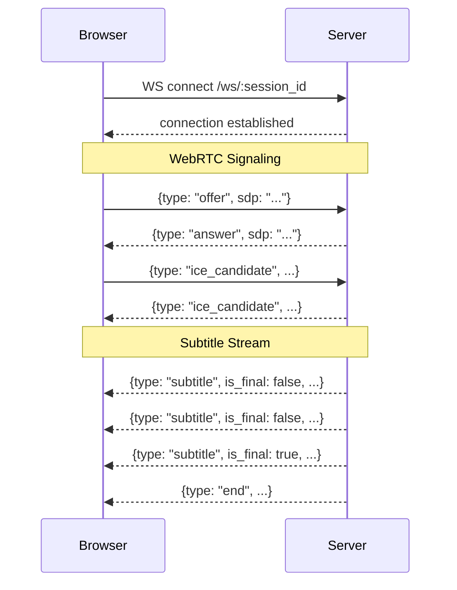

# API Reference

[Architecture](architecture.md) | [API Reference](api.md) | [Transcription Modes](transcription-modes.md) | [Frontend](frontend.md) | [FAB Teletext](fab-teletext.md) | [Testing](testing.md) | [Deployment](deployment.md)

---

## Base URL & Response Format

Default base URL: `http://localhost:80`

All API responses use a standard envelope:

```json
{
  "success": true,
  "data": { ... },
  "error": null
}
```

On error:

```json
{
  "success": false,
  "data": null,
  "error": "Error description"
}
```

## Health Check

### `GET /health`

Returns `"OK"` (plain text). Use for load balancer health probes.

## Session Endpoints

### `GET /api/sessions`

List all active sessions.

**Response**: `ApiResponse<SessionInfo[]>`

```json
{
  "success": true,
  "data": [
    {
      "id": "abc123",
      "state": "running",
      "model_id": "canary-1b",
      "mode": "speedy",
      "media_source": "news_clip.wav",
      "created_at": "2025-01-15T10:30:00Z"
    }
  ]
}
```

### `POST /api/sessions`

Create a new transcription session.

**Request Body**:

| Field | Type | Default | Description |
|-------|------|---------|-------------|
| `model_id` | string | *required* | Model identifier (e.g. `"canary-1b"`, `"tdt"`) |
| `media_id` | string? | null | Media file ID (mutually exclusive with `srt_channel_id`) |
| `srt_channel_id` | number? | null | SRT channel index (mutually exclusive with `media_id`) |
| `mode` | string | `"speedy"` | Transcription mode (see [modes](transcription-modes.md)) |
| `language` | string | `"de"` | Language code (`en`, `de`, `fr`, `es`) |
| `noise_cancellation` | string | `"none"` | `"none"`, `"rnnoise"` |
| `diarization` | boolean | `false` | Enable speaker diarization |
| `parallel_config` | object? | null | Config for parallel modes |
| `pause_config` | object? | null | Config for pause detection |
| `sentence_completion` | string | `"minimal"` | `"off"`, `"minimal"`, `"balanced"`, `"complete"` |
| `fab_enabled` | string? | null | FAB override: `"default"`, `"enabled"`, `"disabled"` |
| `fab_url` | string? | null | FAB endpoint URL override |
| `fab_send_type` | string? | null | `"growing"` or `"confirmed"` |

**`parallel_config`** (for `parallel` and `pause_parallel` modes):

| Field | Type | Default | Description |
|-------|------|---------|-------------|
| `num_threads` | number | 8 (Canary) / 4 (TDT) | Worker threads |
| `buffer_size_secs` | number | 6 | Sliding window buffer size |

**`pause_config`** (for pause-related modes):

| Field | Type | Default | Description |
|-------|------|---------|-------------|
| `pause_threshold_ms` | number | 300 | Silence duration to trigger segment boundary (150-600) |
| `silence_energy_threshold` | number | 0.008 | RMS energy threshold for silence (0.003-0.02) |
| `max_segment_secs` | number | 5.0 | Maximum segment duration (3.0-15.0) |
| `context_buffer_secs` | number | 0.0 | Context overlap for parallel modes (0.0-3.0) |

**Response**: `ApiResponse<SessionInfo>`

### `GET /api/sessions/:id`

Get session details.

**Response**: `ApiResponse<SessionInfo>`

### `POST /api/sessions/:id/start`

Start transcription for a created session. The session must be in `"created"` state.

**Important**: Connect WebSocket clients *before* calling start to avoid missing early results (especially for VoD mode).

**Response**: `ApiResponse<SessionInfo>` with state `"running"`

### `DELETE /api/sessions/:id`

Stop and remove a session. Terminates the FFmpeg process and transcription thread.

**Response**: `ApiResponse<{message: string}>`

### `GET /api/sessions/:id/transcript`

Download the VoD transcript (only available for `vod` mode sessions).

**Response**: JSON transcript with segments, words, and timing.

## Model & Mode Endpoints

### `GET /api/models`

List available transcription models.

**Response**: `ApiResponse<ModelInfo[]>`

```json
{
  "success": true,
  "data": [
    {
      "id": "tdt",
      "name": "Parakeet TDT 0.6B",
      "model_type": "TDT",
      "languages": ["en"]
    },
    {
      "id": "canary-1b",
      "name": "Canary 1B",
      "model_type": "Canary",
      "languages": ["en", "de", "fr", "es"]
    }
  ]
}
```

### `GET /api/modes`

List all available transcription modes with descriptions.

**Response**: `ApiResponse<ModeInfo[]>`

```json
{
  "success": true,
  "data": [
    {
      "id": "speedy",
      "name": "Speedy (~0.3-1.5s)",
      "description": "Best balance of latency and quality. Uses pause detection."
    }
  ]
}
```

## Media Endpoints

### `GET /api/media`

List media files in the media directory.

**Response**: `ApiResponse<MediaFile[]>`

### `POST /api/media/upload`

Upload an audio file (multipart form data). Maximum 2GB.

**Request**: `multipart/form-data` with file field

**Response**: `ApiResponse<MediaFile>`

### `DELETE /api/media/:id`

Delete a media file.

**Response**: `ApiResponse<{message: string}>`

## Configuration Endpoint

### `GET /api/config`

Returns frontend configuration for WebSocket connection and WebRTC setup.

**Response**:

```json
{
  "wsUrl": "ws://10.84.17.108:80/ws",
  "iceServers": [
    {"urls": "stun:stun.l.google.com:19302"},
    {
      "urls": ["turn:94.130.141.98:3478", "turn:94.130.141.98:3478?transport=tcp"],
      "username": "user",
      "credential": "pass"
    }
  ],
  "iceTransportPolicy": "relay",
  "speakerColors": ["#4A90D9", "#50C878", "#E9967A", "#DDA0DD", ...],
  "fabEnabled": true,
  "fabUrl": "http://10.128.16.38/livetranscription/send",
  "fabSendType": "growing"
}
```

## Utility Endpoints

### `GET /api/noise-cancellation`

List noise cancellation options: `"none"`, `"rnnoise"`.

### `GET /api/diarization`

List diarization options (available when built with `sortformer` feature).

### `GET /api/srt-streams`

List configured SRT live stream channels.

**Response**:

```json
{
  "success": true,
  "streams": [
    {"id": 0, "name": "ORF1", "port": "24001", "display": "ORF1 (24001)"}
  ],
  "configured": true
}
```

## WebSocket Protocol

### Connection

```
WS /ws/:session_id
```

The WebSocket endpoint serves dual purposes:
1. **Subtitle streaming** — server pushes transcription results to all connected clients
2. **WebRTC signaling** — client and server exchange SDP offers/answers and ICE candidates

### Subtitle Messages

#### Partial (live update)

```json
{
  "type": "subtitle",
  "text": "segment text from model",
  "growing_text": "cumulative growing sentence",
  "full_transcript": "all finalized text so far",
  "delta": "new text since last update",
  "tail_changed": false,
  "speaker": 0,
  "start": 1.5,
  "end": 3.2,
  "is_final": false,
  "inference_time_ms": 45
}
```

#### Final (confirmed sentence)

```json
{
  "type": "subtitle",
  "text": "finalized segment text",
  "growing_text": "complete sentence",
  "full_transcript": "all finalized text including this",
  "speaker": 0,
  "start": 1.5,
  "end": 5.0,
  "is_final": true,
  "inference_time_ms": 52
}
```

#### End of stream

```json
{
  "type": "end",
  "total_duration_secs": 120.5,
  "total_segments": 45
}
```

#### VoD complete

```json
{
  "type": "vod_complete",
  "transcript_url": "/api/sessions/abc123/transcript"
}
```

#### Status

```json
{
  "type": "status",
  "state": "running",
  "progress": 0.45,
  "message": "Processing..."
}
```

#### Error

```json
{
  "type": "error",
  "message": "Transcription failed: model not found"
}
```

### WebRTC Signaling Messages

#### Client → Server: Offer

```json
{
  "type": "offer",
  "sdp": "v=0\r\no=- ..."
}
```

#### Server → Client: Answer

```json
{
  "type": "answer",
  "sdp": "v=0\r\no=- ..."
}
```

#### Bidirectional: ICE Candidate

```json
{
  "type": "ice_candidate",
  "candidate": "candidate:...",
  "sdpMLineIndex": 0,
  "sdpMid": "0"
}
```


