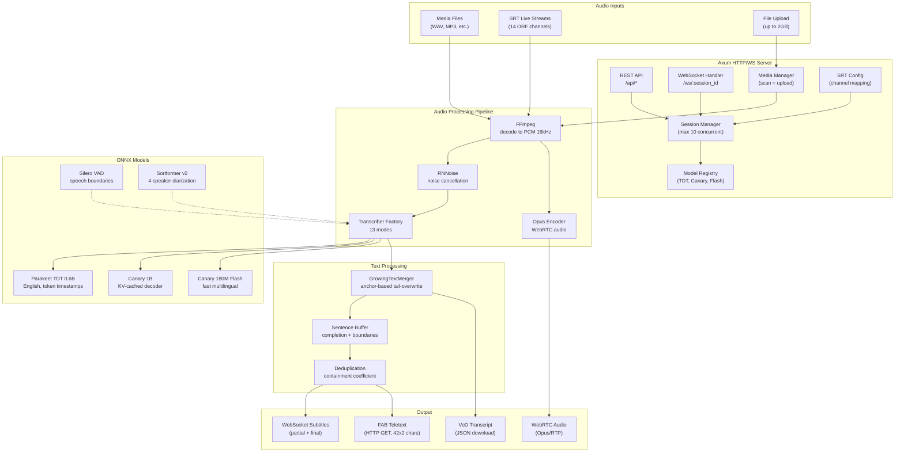
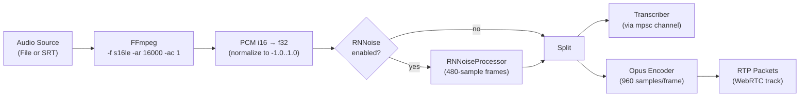
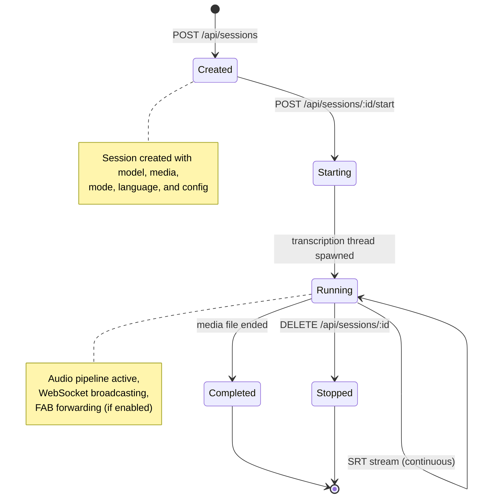
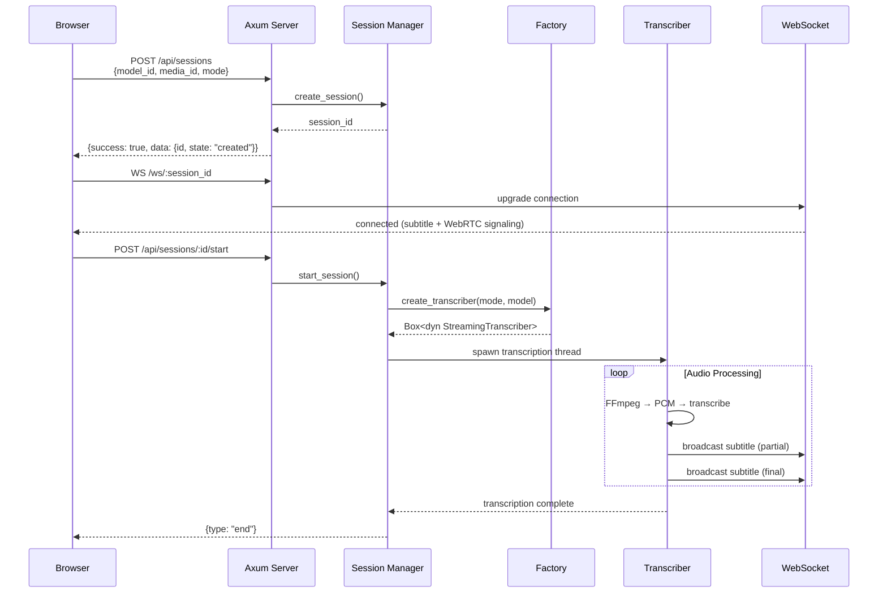
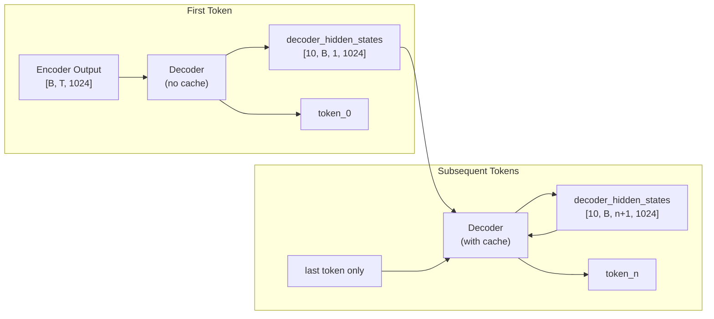

# Architecture

[Architecture](architecture.md) | [API Reference](api.md) | [Transcription Modes](transcription-modes.md) | [Frontend](frontend.md) | [FAB Teletext](fab-teletext.md) | [Testing](testing.md) | [Deployment](deployment.md)

---

## System Overview

## Audio Pipeline

The audio pipeline transforms input sources into PCM samples for transcription and Opus packets for WebRTC playback.

Key details:
- **FFmpeg** decodes any audio format to raw PCM: 16kHz, mono, signed 16-bit little-endian
- For **SRT streams**, FFmpeg uses `-fflags +nobuffer+genpts` and `-flags low_delay` for minimal latency
- **RNNoise** processes 480-sample frames (30ms at 16kHz) for real-time noise suppression
- **Opus encoder** produces 20ms frames (960 samples at 48kHz after resampling) for WebRTC delivery
- Audio samples are sent to the transcriber via `std::sync::mpsc` channel in 2560-sample chunks (160ms)

## Session Lifecycle

Sessions are explicitly started after creation. This two-step process allows:
1. WebSocket clients to connect before transcription begins (avoiding race conditions)
2. Configuration to be finalized before resource allocation

## Request Flow

## Server Binary Structure

The server binary lives in `src/bin/server/` with the following module layout:

| Module | File | Description |
|--------|------|-------------|
| **main** | `main.rs` | Entry point, CLI args (clap), router setup, server startup |
| **api** | `api/mod.rs` | API handler re-exports |
| **api::sessions** | `api/sessions.rs` | Session CRUD, start/stop, transcript download |
| **api::models** | `api/models.rs` | Model listing, mode listing, `ApiResponse<T>` envelope |
| **api::config** | `api/config.rs` | Frontend config (WS URL, ICE servers, FAB settings) |
| **api::media** | `api/media.rs` | Media file listing, upload, delete |
| **api::srt** | `api/srt.rs` | SRT stream listing |
| **api::noise** | `api/noise.rs` | Noise cancellation options |
| **api::diarization** | `api/diarization.rs` | Diarization options |
| **config** | `config.rs` | `LatencyMode` enum, `RuntimeConfig` |
| **state** | `state.rs` | `AppState` (shared server state) |
| **srt_config** | `srt_config.rs` | SRT channel configuration from env |
| **fab_forwarder** | `fab_forwarder.rs` | FAB teletext forwarding, dedup, splitting |
| **transcription** | `transcription/mod.rs` | Session orchestration, `AudioSource` enum |
| **transcription::factory** | `transcription/factory.rs` | Mode-to-transcriber mapping |
| **transcription::configs** | `transcription/configs.rs` | Per-mode configuration factories |
| **transcription::emitters** | `transcription/emitters.rs` | Partial/final/streaming subtitle emission |
| **transcription::audio_pipeline** | `transcription/audio_pipeline.rs` | FFmpeg spawn, PCM read, Opus encode |
| **transcription::vod** | `transcription/vod.rs` | VoD batch transcription |
| **webrtc_handlers** | `webrtc_handlers/mod.rs` | WebSocket upgrade, WebRTC signaling |
| **webrtc_handlers::audio** | `webrtc_handlers/audio.rs` | Opus encoder wrapper |

## Library Modules

The core library (`src/lib.rs`) exposes these public modules:

| Module | Description |
|--------|-------------|
| `canary` | Canary 1B model: encoder, decoder with KV cache, tokenizer |
| `canary_flash` | Canary 180M Flash model with `DecoderKVCache` |
| `realtime_canary` | Streaming Canary transcriber (sliding window) |
| `realtime_canary_flash` | Streaming Canary Flash transcriber |
| `realtime_canary_vad` | VAD-triggered Canary transcriber |
| `realtime_tdt` | Streaming TDT transcriber with diarization |
| `realtime_tdt_vad` | VAD-triggered TDT transcriber (requires sortformer) |
| `parallel_canary` | Multi-threaded parallel Canary inference |
| `parallel_tdt` | Multi-threaded parallel TDT inference |
| `pause_parallel_canary` | Pause-triggered parallel Canary inference |
| `pause_parallel_tdt` | Pause-triggered parallel TDT inference |
| `streaming_transcriber` | `StreamingTranscriber` trait and `TranscriberFactory` |
| `growing_text` | `GrowingTextMerger` — anchor-based tail-overwrite text merging |
| `sentence_buffer` | Sentence boundary detection and completion |
| `vod_transcriber` | VoD batch transcription (10-min chunks) |
| `model_registry` | `ModelRegistry` — model discovery and type mapping |
| `media_manager` | `MediaManager` — file scanning and upload handling |
| `session` | `SessionManager`, `TranscriptionSession`, `SessionState` |
| `vad` | Silero VAD wrapper, `VadSegmenter` |
| `noise_cancellation` | RNNoise wrapper |
| `sortformer` / `sortformer_stream` | Sortformer v2 diarization (feature-gated) |

## Canary 1B KV Cache

The Canary 1B decoder uses a KV (key-value) cache for O(n) incremental decoding instead of O(n^2) full re-computation:

- **Decoder ONNX I/O**: `decoder_mems` [10, B, mems_len, 1024] input, `decoder_hidden_states` [10, B, seq_len, 1024] output
- **Cached path**: Feed `decoder_hidden_states` back as `decoder_mems`, pass only last token as `input_ids`
- **Performance**: Cached decoding achieves ~10% WER vs ~60% WER with full re-computation on German test audio
- **Fallback**: `greedy_decode()` tries cached path first, falls back to full decode if cache shape mismatches
