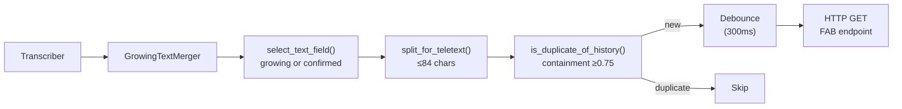
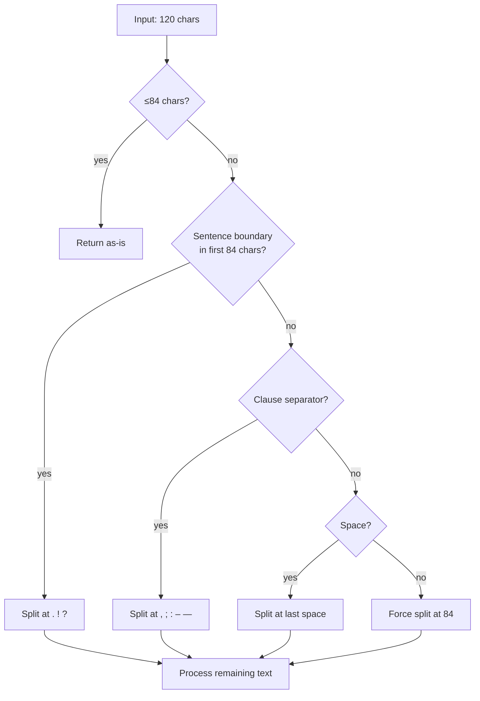
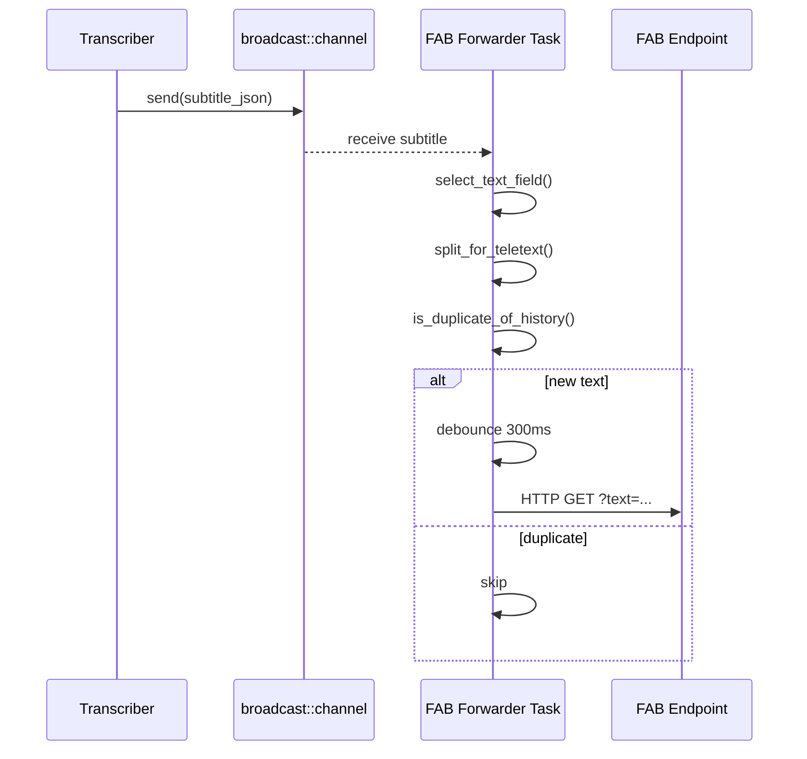

# FAB Teletext System

[Architecture](architecture.md) | [API Reference](api.md) | [Transcription Modes](transcription-modes.md) | [Frontend](frontend.md) | [FAB Teletext](fab-teletext.md) | [Testing](testing.md) | [Deployment](deployment.md)

---

## Overview

FAB (Fernsehausstrahlungsbetrieb) is a live transcription forwarding system that sends subtitle text to external teletext endpoints via HTTP. The system handles the unique constraints of teletext display: a maximum of 42 characters per line and 2 lines visible at once (84 characters total).



## FAB_SEND_TYPE

Two modes control which text field is forwarded:

| Send Type | Text Source | Behavior |
|-----------|------------|----------|
| `"growing"` (default) | `growing_text` field | Cumulative text that grows as the speaker talks. Falls back to `text` if empty. Shows progressive refinement. |
| `"confirmed"` | `text` field | Only finalized segment text. Sent once per confirmed sentence. Cleaner but with gaps between sentences. |

## Text Processing Pipeline

### 1. Text Selection

```rust
fn select_text_field(msg, send_type) -> &str
```

- `"confirmed"` mode: uses only the `text` field (finalized segment text)
- `"growing"` mode: uses `growing_text` (cumulative), falls back to `text`

### 2. Teletext Splitting

```rust
fn split_for_teletext(text: &str, max_chars: usize) -> Vec<String>
```

Splits text into chunks of at most 84 characters, preserving readability by preferring splits at:

1. **Sentence boundaries** — `.` `!` `?` (but not dots inside numbers like `3.5`)
2. **Clause separators** — `,` `;` `:` `–` `—`
3. **Word boundaries** — spaces



The function handles UTF-8 correctly (counts characters, not bytes) and avoids splitting numbers like "3.5" at the decimal point.

### 3. Deduplication

```rust
fn is_duplicate_of_history(text: &str, history: &VecDeque<String>) -> bool
```

Checks the new text against the last 10 sent texts using three methods:

| Method | Condition |
|--------|-----------|
| **Exact match** | `text == history_entry` |
| **Substring** | `history_entry.contains(text)` or `text.contains(history_entry)` |
| **Containment coefficient** | `|A∩B| / min(|A|, |B|) ≥ 0.75` with minimum 3 shared words |

The containment coefficient is more robust than Jaccard similarity for sliding-window text, where extra words from the window can dilute the overlap ratio. Comparison is case-insensitive with punctuation stripped.

### 4. Debounce

A 300ms debounce window coalesces rapid-fire text updates into single HTTP requests. Split intermediate lines (from multi-chunk splits) are sent immediately without debounce.

## Configuration

### Environment Variables

| Variable | Default | Description |
|----------|---------|-------------|
| `FAB_URL` | — | FAB endpoint URL (e.g. `http://10.128.16.38/livetranscription/send`) |
| `FAB_ENABLED` | `true` when `FAB_URL` set | Enable/disable FAB forwarding globally |
| `FAB_SEND_TYPE` | `"growing"` | Default send type: `"growing"` or `"confirmed"` |

### Per-Session Override

Each session can override FAB settings via the create session API:

```json
{
  "model_id": "canary-1b",
  "media_id": "news.wav",
  "fab_enabled": "enabled",
  "fab_url": "http://custom-endpoint/send",
  "fab_send_type": "confirmed"
}
```

Values for `fab_enabled`:
- `"default"` — use server setting
- `"enabled"` — force enable for this session
- `"disabled"` — force disable for this session

## Architecture Details

The FAB forwarder runs as an async Tokio task that subscribes to a session's `broadcast::channel`:



### Constants

| Constant | Value | Description |
|----------|-------|-------------|
| `DEBOUNCE_MS` | 300 | Debounce window in milliseconds |
| `CONTAINMENT_THRESHOLD` | 0.75 | Minimum containment coefficient for dedup |
| `MIN_SHARED_WORDS` | 3 | Minimum shared words for containment check |
| `MAX_TELETEXT_CHARS` | 84 | Maximum characters per teletext display (42x2) |
| `SENT_HISTORY_SIZE` | 10 | Number of recent texts kept for dedup |

## Frontend Dedup

The frontend (`subtitles.js`) mirrors the backend deduplication logic:

- `splitForTeletext()` — same splitting algorithm
- `isDuplicateOfHistory()` — same containment coefficient check
- History size: 15 entries (slightly larger than backend)

This dual-layer dedup ensures clean display even when the backend forwards some near-duplicates.
