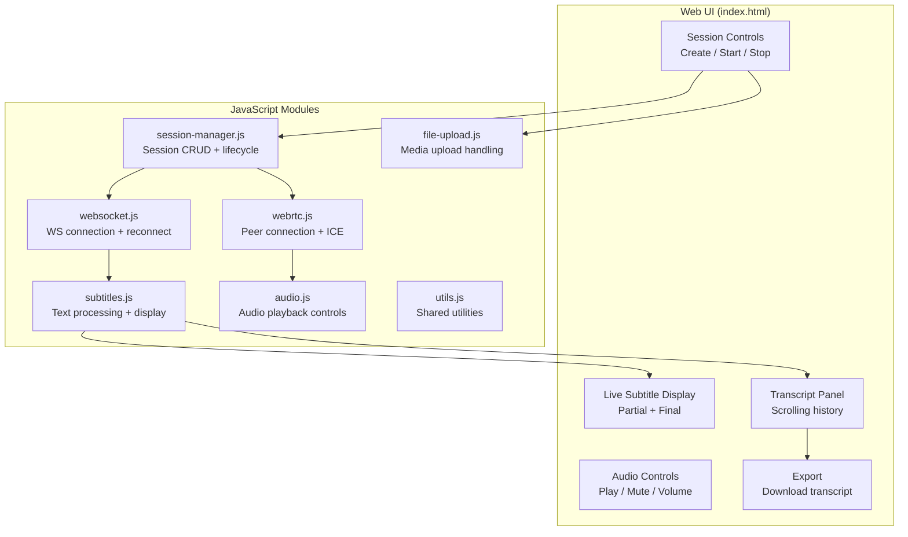
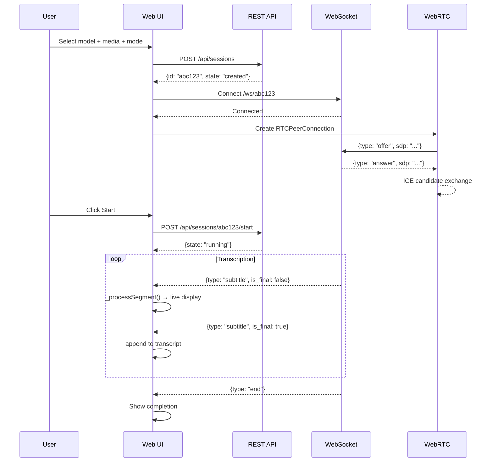
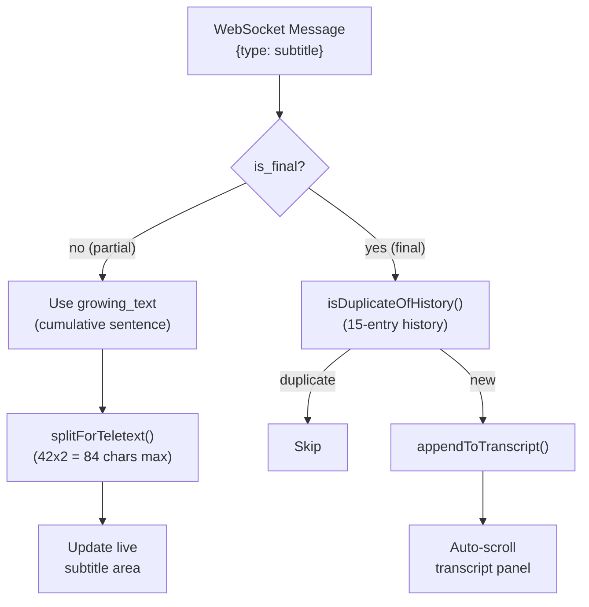
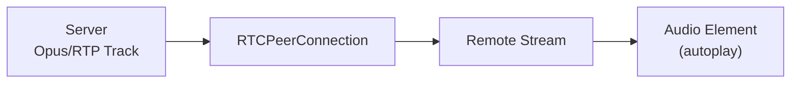

# Frontend

[Architecture](architecture.md) | [API Reference](api.md) | [Transcription Modes](transcription-modes.md) | [Frontend](frontend.md) | [FAB Teletext](fab-teletext.md) | [Testing](testing.md) | [Deployment](deployment.md)

---

## Overview

The frontend is a vanilla JavaScript web application served as static files from the `frontend/` directory. It provides a UI for managing transcription sessions, viewing live subtitles, and controlling WebRTC audio playback.

## JavaScript Modules

| Module | File | Description |
|--------|------|-------------|
| **Session Manager** | `session-manager.js` | Session CRUD via REST API, lifecycle coordination, UI state management |
| **WebSocket** | `websocket.js` | WebSocket connection, automatic reconnection, message routing |
| **WebRTC** | `webrtc.js` | RTCPeerConnection setup, SDP offer/answer, ICE candidate exchange |
| **Subtitles** | `subtitles.js` | `_processSegment()` pipeline: growing text merging, teletext splitting, deduplication, display |
| **File Upload** | `file-upload.js` | Drag-and-drop and button-based media upload via multipart POST |
| **Audio** | `audio.js` | WebRTC audio element management, play/mute/volume controls |
| **Utils** | `utils.js` | Shared utility functions |

## Session Flow

## Subtitle Processing Pipeline

The `_processSegment()` function in `subtitles.js` is the core text processing pipeline:

### `splitForTeletext(text, maxChars)`

Splits text into lines of at most 84 characters (teletext constraint: 42 chars/line x 2 lines), preferring breaks at:
1. Sentence boundaries (`.` `!` `?`)
2. Clause separators (`,` `;` `:` `–` `—`)
3. Word boundaries (spaces)

### `isDuplicateOfHistory(text, history)`

Checks if text is a duplicate of any of the last 15 entries using:
- Exact match
- Substring containment
- Containment coefficient: `|A∩B| / min(|A|, |B|)` with threshold 0.75 and minimum 3 shared words

## WebRTC Audio Playback

The browser receives audio via WebRTC for synchronized playback alongside subtitles.

### Reconnection Logic

When the WebRTC connection fails:

1. ICE connection state changes to `"failed"` or `"disconnected"`
2. 5-second timeout before closing
3. Peer connection is closed
4. Automatic reconnect with exponential backoff
5. New SDP offer/answer exchange

### ICE Configuration

The frontend fetches ICE server configuration from `GET /api/config`:

- **STUN**: `stun:stun.l.google.com:19302` (unless relay-only mode)
- **TURN**: Configured server with both UDP and TCP transport
- **Transport policy**: `"relay"` when `FORCE_RELAY=true`, `"all"` otherwise
