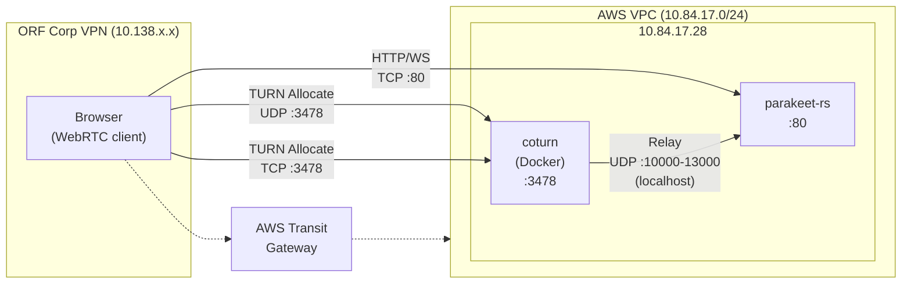

# Network Diagram

## Overview

Parakeet-rs runs inside an AWS VPC. Browsers on the ORF corporate network reach it via a Transit Gateway connecting the VPN to the VPC.

## Architecture

## Communication Flows

| Flow | Protocol | Port(s) | Direction | Purpose |
|------|----------|---------|-----------|---------|
| Web UI + API | TCP (HTTP) | 80 | Browser → Server | Frontend, REST API, WebSocket |
| TURN signaling | UDP | 3478 | Browser → Coturn | TURN allocate/refresh (primary) |
| TURN signaling | TCP | 3478 | Browser → Coturn | TURN allocate/refresh (fallback for strict firewalls) |
| Media relay | UDP | 10000–13000 | Coturn → parakeet-rs | RTP audio relayed locally on same host |
| WebSocket | TCP | 80 | Browser → Server | Transcription results (live subtitles) |

## Security Groups (`orf-kiut-dev-sg`)

| Rule | Protocol | Port | Source |
|------|----------|------|--------|
| HTTP | TCP | 80 | 0.0.0.0/0 |
| TURN | UDP | 3478 | 0.0.0.0/0 |
| TURN (TCP) | TCP | 3478 | 0.0.0.0/0 |
| SRT ingest | UDP | 13001–13032 | 0.0.0.0/0 |

## Notes

- **FORCE_RELAY=true**: Server is configured for relay-only ICE policy (no STUN) because direct connectivity between 10.138.x.x and 10.84.17.x is not guaranteed through the Transit Gateway for UDP.
- **Coturn runs in Docker** on the same host as parakeet-rs, so relay traffic between coturn and webrtc-rs stays on localhost.
- **Ephemeral credentials**: Both browser (via `/api/config`) and server-side webrtc-rs use HMAC-SHA1 ephemeral credentials with a shared secret.
