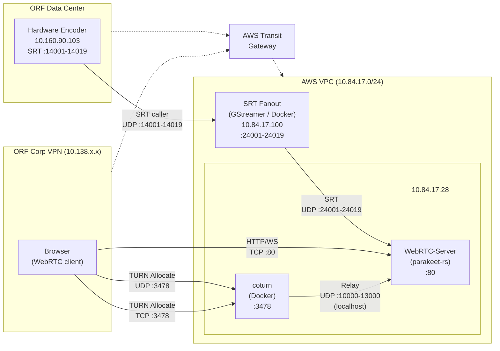

# Network Diagram

## Overview

The WebRTC-Server (parakeet-rs) runs inside an AWS VPC. Browsers on the ORF corporate network reach it via a Transit Gateway connecting the VPN to the VPC. Live broadcast audio arrives from a hardware encoder in the ORF data center, passes through an SRT Fanout service (GStreamer) in the VPC, and is consumed by the WebRTC-Server for real-time transcription.

## Architecture

## SRT Channels

The hardware encoder provides 14 broadcast channels. The SRT Fanout re-publishes them with a +10000 port offset:

| Channel | Encoder Port | Fanout Port | Description |
|---------|-------------|-------------|-------------|
| ORF1 | 14001 | 24001 | ORF eins |
| ORF2 | 14002 | 24002 | ORF 2 |
| KIDS | 14011 | 24011 | ORF KIDS |
| ORFS | 14004 | 24004 | ORF Sport |
| ORF-B | 14013 | 24013 | ORF Burgenland |
| ORF-K | 14019 | 24019 | ORF Kaernten |
| ORF-NOE | 14012 | 24012 | ORF Niederoesterreich |
| ORF-OOE | 14014 | 24014 | ORF Oberoesterreich |
| ORF-S | 14015 | 24015 | ORF Salzburg |
| ORF-ST | 14018 | 24018 | ORF Steiermark |
| ORF-T | 14016 | 24016 | ORF Tirol |
| ORF-V | 14017 | 24017 | ORF Vorarlberg |
| ORF-W | 14011 | 24011 | ORF Wien |
| ORF-SI | 14016 | 24016 | ORF Suedtirol/Italien |

## Communication Flows

| Flow | Protocol | Port(s) | Direction | Purpose |
|------|----------|---------|-----------|---------|
| SRT ingest (encoder → fanout) | UDP (SRT) | 14001–14019 | Encoder → SRT Fanout | Live broadcast MPEG-TS from hardware encoder |
| SRT ingest (fanout → server) | UDP (SRT) | 24001–24019 | WebRTC-Server → SRT Fanout | WebRTC-Server connects as SRT caller |
| Web UI + API | TCP (HTTP) | 80 | Browser → WebRTC-Server | Frontend, REST API, WebSocket |
| TURN signaling | UDP | 3478 | Browser → Coturn | TURN allocate/refresh (primary) |
| TURN signaling | TCP | 3478 | Browser → Coturn | TURN allocate/refresh (fallback for strict firewalls) |
| Media relay | UDP | 10000–13000 | Coturn → WebRTC-Server | RTP audio relayed locally on same host |
| WebSocket | TCP | 80 | Browser → WebRTC-Server | Transcription results (live subtitles) |

## Security Groups (`orf-kiut-dev-sg`)

| Rule | Protocol | Port | Source |
|------|----------|------|--------|
| HTTP | TCP | 80 | 0.0.0.0/0 |
| TURN | UDP | 3478 | 0.0.0.0/0 |
| TURN (TCP) | TCP | 3478 | 0.0.0.0/0 |
| SRT fanout output | UDP | 24001–24019 | VPC internal |

## SRT Fanout (GStreamer)

- **Service**: `srt-fanout-gstreamer` — Docker container on a dedicated EC2 instance (10.84.17.100)
- **Mode**: `PASSTHROUGH` — zero-copy tee element, no transcoding
- **Port mapping**: Input port + 10000 = output port (e.g., 14001 → 24001)
- **Auto-reconnect**: Reconnects automatically on encoder failure
- **Infrastructure**: Terraform-managed ASG with fixed ENI/private IP, Ansible-deployed

## Notes

- **FORCE_RELAY=true**: Server is configured for relay-only ICE policy (no STUN) because direct connectivity between 10.138.x.x and 10.84.17.x is not guaranteed through the Transit Gateway for UDP.
- **Coturn runs in Docker** on the same host as the WebRTC-Server, so relay traffic between coturn and webrtc-rs stays on localhost.
- **Ephemeral credentials**: Both browser (via `/api/config`) and server-side webrtc-rs use HMAC-SHA1 ephemeral credentials with a shared secret.
- **SRT connection direction**: The hardware encoder pushes to the fanout (SRT caller → listener). The WebRTC-Server pulls from the fanout (SRT caller → listener on fanout output ports).
