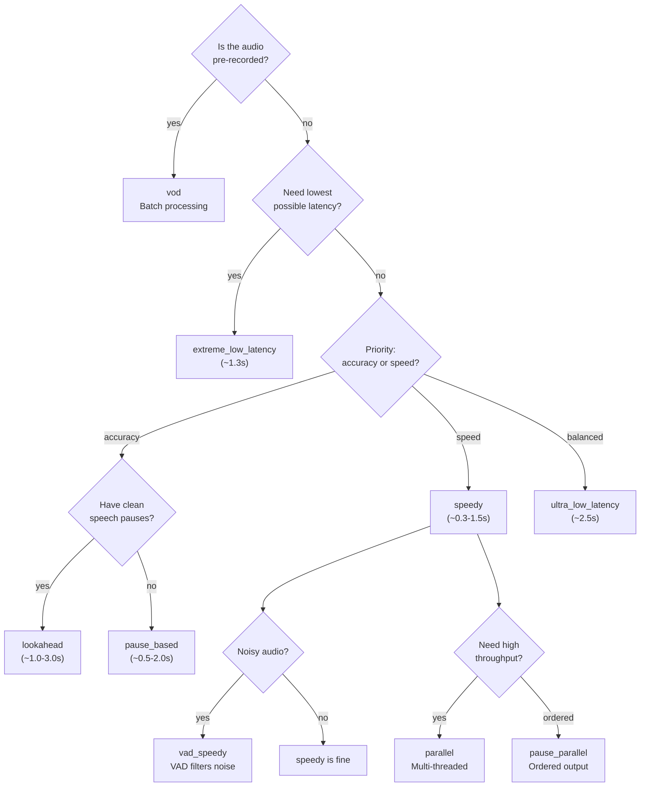
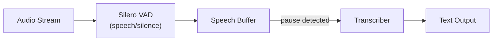
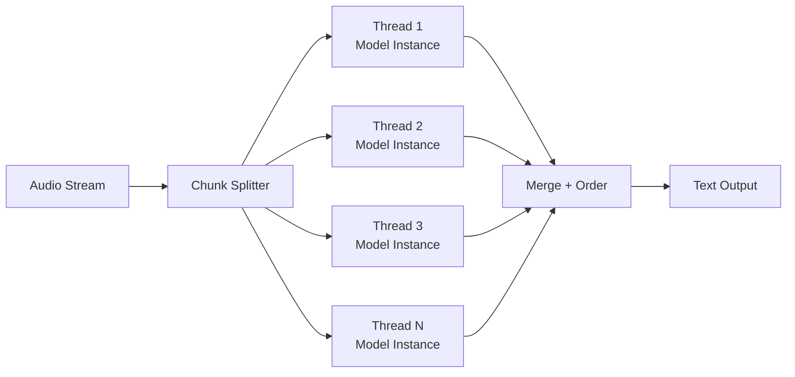
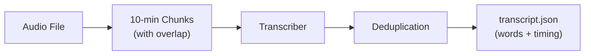

# Transcription Modes

[Architecture](architecture.md) | [API Reference](api.md) | [Transcription Modes](transcription-modes.md) | [Frontend](frontend.md) | [FAB Teletext](fab-teletext.md) | [Testing](testing.md) | [Deployment](deployment.md)

---

## Mode Comparison

| Mode | Latency | Pause Detection | Multi-threaded | VAD | Best For |
|------|---------|-----------------|----------------|-----|----------|
| `speedy` | ~0.3-1.5s | yes | no | no | General-purpose live subtitling |
| `pause_based` | ~0.5-2.0s | yes | no | no | Higher accuracy, natural sentence breaks |
| `low_latency` | ~3.5s | no | no | no | Predictable fixed timing |
| `ultra_low_latency` | ~2.5s | no | no | no | Interactive applications |
| `extreme_low_latency` | ~1.3s | no | no | no | Fastest possible response |
| `lookahead` | ~1.0-3.0s | yes | no | no | Best quality with future context |
| `vad_speedy` | ~0.3s pause | yes | no | yes | Clean speech with clear pauses |
| `vad_pause_based` | ~0.7s pause | yes | no | yes | Noisy environments, deliberate speech |
| `vad_sliding_window` | 5 seg / 10s | n/a | no | yes | Long-form content with context |
| `asr` | continuous | no | no | no | Raw streaming, custom post-processing |
| `parallel` | sliding window | no | yes | no | High throughput, GPU-heavy |
| `pause_parallel` | pause-triggered | yes | yes | no | Ordered output with parallelism |
| `vod` | batch | n/a | no | no | Pre-recorded files, offline processing |

## Mode Selection Guide



## Standard Modes

Standard modes use a sliding window over the audio buffer. The window grows as audio arrives and text is emitted at regular intervals.

### `speedy`

Best balance of latency and quality. Default mode.

| Parameter | Canary | TDT |
|-----------|--------|-----|
| Buffer size | 8s | 8s |
| Process interval | 0.5s | 0.2s |
| Min audio | 1.0s | — |
| Pause detection | yes (0.6s) | yes (0.6s) |
| Confirm threshold | — | 0.5s |

### `pause_based`

Higher accuracy with pause-triggered finalization. Waits for speech pauses before confirming segments.

| Parameter | Canary | TDT |
|-----------|--------|-----|
| Buffer size | 10s | 10s |
| Process interval | 2.0s | 0.3s |
| Min audio | 2.0s | — |
| Pause detection | yes (0.6s) | yes (0.5s) |

### `low_latency`

Fixed latency without pause detection. Text is confirmed on a timer regardless of speech pauses.

| Parameter | Canary | TDT |
|-----------|--------|-----|
| Buffer size | 10s | 10s |
| Process interval | 1.5s | 1.5s |
| Pause detection | no | no |
| Confirm threshold | — | 2.0s |

### `ultra_low_latency`

Faster response for interactive applications.

| Parameter | Canary | TDT |
|-----------|--------|-----|
| Buffer size | 6s | 8s |
| Process interval | 1.0s | 1.0s |
| Pause detection | yes (0.5s) | no |

### `extreme_low_latency`

Fastest possible response. May sacrifice accuracy for speed.

| Parameter | Canary | TDT |
|-----------|--------|-----|
| Buffer size | 4s | 5s |
| Process interval | 0.5s | 0.5s |
| Min audio | 0.5s | — |
| Pause threshold | 0.4s | 0.5s |

### `lookahead`

Best quality by using future context. The transcriber waits for additional audio before confirming segments.

| Parameter | Canary | TDT |
|-----------|--------|-----|
| Buffer size | 10s | 10s |
| Process interval | 2.0s | 0.3s |
| Pause detection | yes (0.6s) | yes (0.5s) |
| Lookahead mode | — | yes (2 segments) |

## VAD-Triggered Modes

VAD (Voice Activity Detection) modes use Silero VAD to detect speech boundaries before sending audio to the transcriber. This reduces unnecessary processing and improves accuracy in noisy conditions.



### `vad_speedy`

VAD-triggered with short pause threshold. Transcribes complete utterances after brief pauses.

- **Pause threshold**: ~0.3s
- **Best for**: Clean speech with natural pauses

### `vad_pause_based`

VAD-triggered with longer pause threshold. More accurate with deliberate speech patterns.

- **Pause threshold**: ~0.7s
- **Best for**: Noisy environments, formal speech

### `vad_sliding_window`

Sliding window VAD mode. Buffers 5 speech segments or 10 seconds, then transcribes with context overlap for better accuracy.

- **Window**: 5 segments / 10s max
- **Context overlap**: yes
- **Best for**: Long-form content, lectures, meetings

## Parallel Modes

Parallel modes use multiple threads to process audio concurrently, enabling higher throughput on multi-core systems.



### `parallel`

Multi-threaded sliding window inference. Each thread loads its own model instance.

| Parameter | Canary | TDT |
|-----------|--------|-----|
| Default threads | 8 | 4 |
| Buffer size | 6s | 6s |
| Chunk duration | 1.0s | 1.0s |
| Memory per thread | ~2.5GB | ~1.5GB |

Configure via `parallel_config`:
```json
{
  "parallel_config": {
    "num_threads": 8,
    "buffer_size_secs": 6
  }
}
```

### `pause_parallel`

Pause-triggered parallel inference. Dispatches work to threads on speech pauses for natural segment boundaries with ordered output.

| Parameter | Canary | TDT |
|-----------|--------|-----|
| Default threads | 8 | 4 |
| Pause threshold | 0.5s | 0.5s |
| Max segment | 6.0s | 6.0s |
| Context buffer | 2.0s | 2.0s |

Configure via `pause_config`:
```json
{
  "pause_config": {
    "pause_threshold_ms": 500,
    "silence_energy_threshold": 0.008,
    "max_segment_secs": 6.0,
    "context_buffer_secs": 2.0
  }
}
```

## Pure Streaming

### `asr`

Pure streaming ASR without VAD or pause detection. Processes audio continuously with a sliding window. Useful when you want to apply your own post-processing logic.

## Batch Processing

### `vod`

Video-on-Demand batch transcription. Processes pre-recorded files in 10-minute chunks with overlap and deduplication. Generates a downloadable `transcript.json` with word-level timing.



- Processes entire files offline
- Word-level timestamps
- Overlap deduplication for chunk boundaries
- Download via `GET /api/sessions/:id/transcript`
